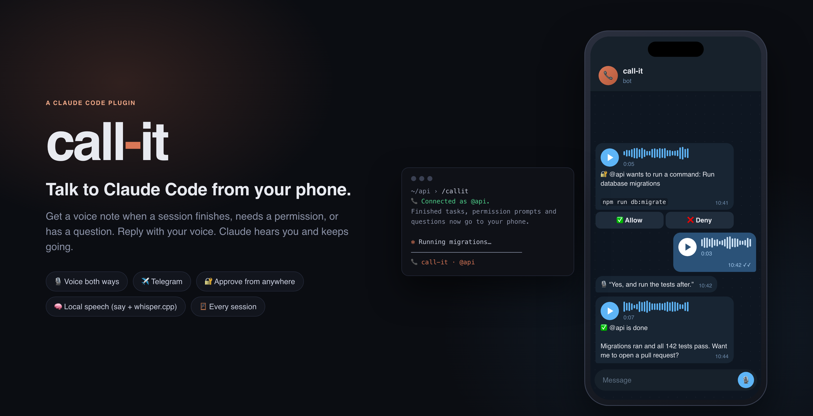
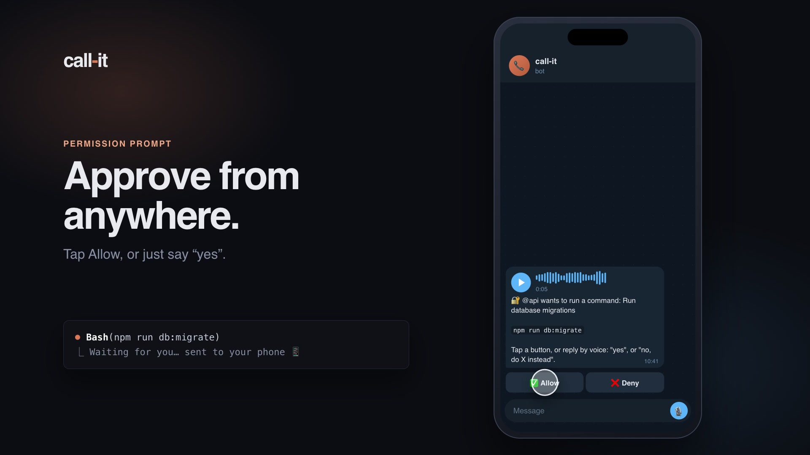
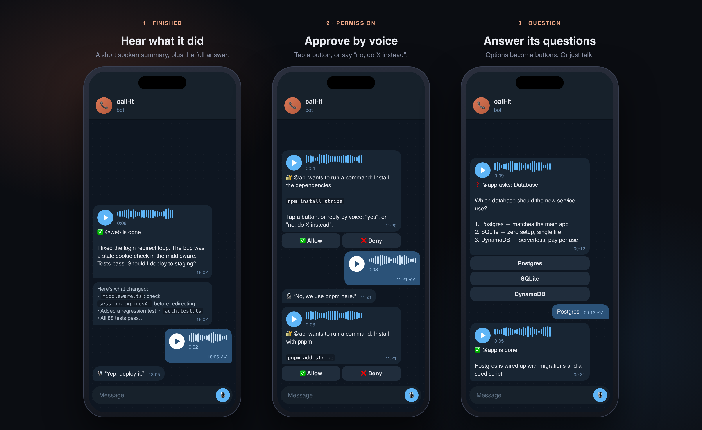
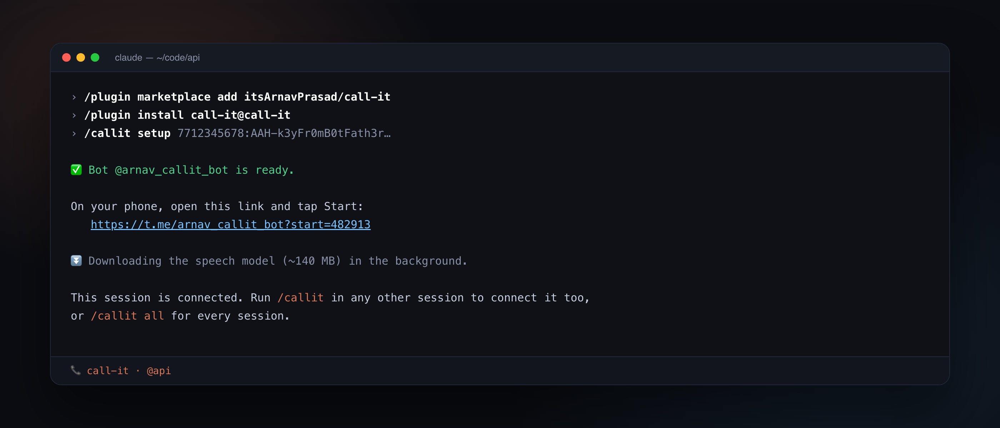
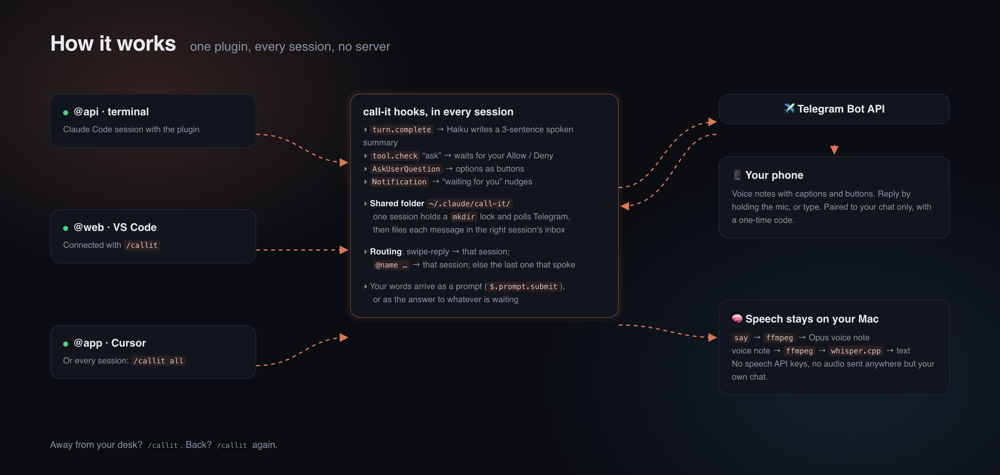

<p align="center">
  
</p>

<p align="center">
  <b>Walk away from your laptop. Claude calls you when it needs you.</b><br>
  A Claude Code plugin that sends you a voice note when a session finishes, needs a permission, or has a question,<br>
  and turns your spoken reply into its next instruction.
</p>

<p align="center">
  
  
  
  
</p>

---

You start a long task, go make coffee, and come back twenty minutes later. Claude has been sitting on a permission prompt the whole time. Or it finished in two minutes and asked you a question you never saw.

**call-it** fixes that. Connect a session with `/callit`, put your phone in your pocket, and:

- 🔊 **When Claude finishes**, you get a voice note: a three-sentence spoken summary, written by Claude, plus the full answer as text.
- 🔐 **When Claude needs permission**, you get the command with **Allow / Deny** buttons. Or say *"no, we use pnpm here"* and Claude hears why.
- ❓ **When Claude asks a question**, the options arrive as buttons. Tap one, or just talk.
- 🔔 **When Claude is waiting on you**, you get a nudge.
- 🎙 **Reply with a voice note** at any time, and it becomes your next prompt.

It works in every Claude Code session you have (terminal, VS Code, Cursor), all at once, from one Telegram chat.

<p align="center">
  <a href="brag-output/brag.mp4"></a><br>
  <sub>▶ <a href="brag-output/brag.mp4">Watch the 22-second demo</a> (with sound: that's the actual voice note)</sub>
</p>

<p align="center">
  
</p>

## Setup (about 2 minutes)

You need **macOS**, **Claude Code 2.1.287 or newer**, and **Telegram** on your phone.

**1. Install the plugin.** In any Claude Code session:

```
/plugin marketplace add itsArnavPrasad/call-it
/plugin install call-it@call-it
```

In VS Code or Cursor, the chat panel has no `/plugin` command. Run this in a terminal instead, then start a new chat:

```sh
claude plugin marketplace add itsArnavPrasad/call-it
claude plugin install call-it@call-it
```

**2. Make a bot.** In Telegram, open [@BotFather](https://t.me/BotFather), send `/newbot`, pick any name, and copy the token it gives you.

**3. Connect.** Run:

```
/callit setup <your-bot-token>
```

You'll get a link. Open it on your phone and tap **Start**. You're paired.

<p align="center">
  
</p>

That's all. If `ffmpeg` or `whisper-cpp` is missing, setup asks Claude to install them with Homebrew. The speech model (~140 MB) downloads in the background.

## Using it

| In Claude Code | What it does |
| --- | --- |
| `/callit` | Connect this session to your phone, or disconnect it if it's already connected |
| `/callit all` | Connect every session automatically, including new ones (run again to turn off) |
| `/callit name <label>` | Rename this session (it's named after its folder by default) |
| `/callit status` | Bot, pairing, connected sessions, speech model |
| `/callit test` | Send a test voice note |
| `/callit off` | Disconnect this session |

A connected session shows `📞 call-it · @name` in the status line.

**On your phone:**

| You do | Goes to |
| --- | --- |
| Swipe-reply to a message | The session that sent it |
| Start a message with `@name` | That session |
| Anything else | The session that messaged you last |
| `/sessions` | Lists connected sessions |

A voice reply is transcribed on your Mac and echoed back (`🎙 "…"`), so you can see what Claude heard. Text works too.

When a permission or question is waiting, your reply answers it. *"Yes"*, *"go ahead"* and *"sure"* approve; *"no"*, *"stop"* and *"wait"* deny. Anything less clear is judged by Claude Haiku, and if it's still unclear, the answer is no. A denial with a reason (*"no, use the staging database"*) passes the reason on to Claude, so it can change course instead of just stopping.

When nothing is waiting, your reply becomes the session's next prompt. If Claude is mid-task, it's queued for when the task ends.

> **Tip:** connect when you leave and disconnect when you're back. While a session is connected, its permission prompts go to your phone rather than the terminal. If you don't answer within an hour, the normal dialog takes over.

## How it works

<p align="center">
  
</p>

call-it is a single Claude Code plugin: one TypeScript hooks module, no server, no daemon, nothing else to run.

- **Events.** It hooks `turn.complete` (finished), `tool.check` (a permission that would ask you), the `AskUserQuestion` tool call (questions), and `Notification` (waiting nudges).
- **Speaking.** Claude Haiku turns the final message into a short script. macOS `say` speaks it, `ffmpeg` encodes it as an Opus voice note, and `curl` uploads it to your chat.
- **Listening.** A voice reply is downloaded, converted with `ffmpeg`, and transcribed by **whisper.cpp** on your machine.
- **Many sessions, one bot.** Sessions share `~/.claude/call-it/`. Each one heartbeats a small record there. Whichever session grabs an atomic `mkdir` lock polls Telegram for that round, and files each incoming message in the right session's inbox. Any session can do the polling, so nothing breaks when one closes.
- **Replying.** An inbox item either answers whatever the session is waiting on, or becomes a new prompt via `$.prompt.submit`.

## Privacy and security

- **Your bot only talks to you.** Pairing uses a one-time code in the link. Messages from any other chat are ignored.
- **Speech never leaves your Mac.** Text-to-speech is macOS `say` and speech-to-text is whisper.cpp, both local. The only network traffic is Telegram itself.
- **The token stays private.** It's stored in `~/.claude/call-it/config.json` with `600` permissions, and passed to `curl` on stdin so it never shows up in `ps`.
- **What gets sent.** Your Telegram chat receives Claude's summaries, the full final answers, and the commands it wants to run. If that's sensitive, don't connect that session.
- **When in doubt, deny.** An unclear spoken reply to a permission prompt counts as a no.

## Requirements

| | |
| --- | --- |
| Claude Code | 2.1.287+ (uses the plugin hooks API, which is early access) |
| OS | macOS (for `say`). Elsewhere it falls back to text messages. |
| `ffmpeg`, `whisper-cpp` | `brew install ffmpeg whisper-cpp` (setup can do this for you) |
| Phone | Telegram |

## Troubleshooting

- **Nothing arrives on my phone.** Run `/callit status`. Check that the phone says `paired` and this session says `connected`. Then run `/callit test`.
- **"The speech model is still downloading."** Wait a minute, or re-run `/callit setup <token>` to restart the download. Text replies work meanwhile.
- **The voice is robotic.** Pick a better macOS voice: install one under *System Settings → Accessibility → Spoken Content*, then add `"voice": "Ava (Premium)"` to `~/.claude/call-it/config.json`.
- **A reply went to the wrong session.** Swipe-reply to that session's message, or start with `@name`.

## Running it from a clone

```sh
git clone https://github.com/itsArnavPrasad/call-it
claude --plugin-dir ./call-it
```

For VS Code or Cursor, where you can't pass flags, add the folder to `~/.claude/settings.json`:

```json
{ "env": { "CLAUDE_CODE_PLUGIN_DIRS": "/path/to/call-it" } }
```

## Development

```
hooks/register.ts    events, Telegram, speech, commands
hooks/lib.ts         pure logic: routing, yes/no, tool descriptions, text for speech
tests/lib.test.ts    unit tests        →  claude plugin test .
test/e2e.sh          end to end: a real `claude -p` against a fake Telegram
test/fake_telegram.py  the fake Telegram (plays the phone: taps Allow, or answers by voice)
docs/images/src      README images as HTML  →  docs/images/render.sh
```

```sh
claude plugin validate .claude-plugin/plugin.json
claude plugin test .
test/e2e.sh      # Allow tapped → command runs → "done" voice note; "No, don't do that" spoken → denied
```

## License

MIT. Made by [Arnav Prasad](https://github.com/itsArnavPrasad).
